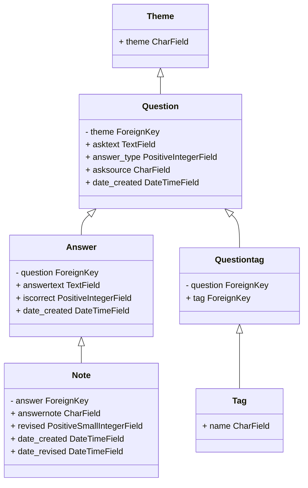

```mermaid
classDiagram
    Theme <|-- Question
    class Theme{
      + theme CharField
    }  

    Question <|-- Answer
    class Question{
      - theme ForeignKey
      + asktext TextField 
      + answer_type PositiveIntegerField 
      + asksource CharField
      + date_created DateTimeField
    }

    class Answer{
      - question ForeignKey
      + answertext TextField 
      + iscorrect PositiveIntegerField 
      + date_created DateTimeField
    }

    Question <|-- Questiontag
    class Questiontag{
      - question ForeignKey
      + tag ForeignKey 
    } 

    Answer <|-- Note
    class Note{
      - answer ForeignKey
      + answernote CharField
      + revised PositiveSmallIntegerField
      + date_created DateTimeField
      + date_revised DateTimeField
    }  
        
    Questiontag <|-- Tag
    class Tag{
      + name CharField
    } 
```